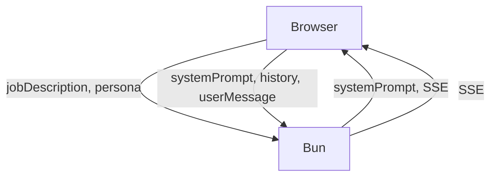

# Client-Server State Flow

## Objective
Explain how the browser and Bun backend share responsibility for interview state without server persistence.

## State ownership

- **Client owns**:
  - `systemPrompt`
  - `history` array
  - current user message
  - scorecard state

- **Server owns**:
  - request validation
  - prompt proxying
  - SSE streaming
  - static asset delivery

## Flow description

1. User starts interview
2. Browser builds request and sends `jobDescription` + `persona`
3. Server returns streamed AI response and `systemPrompt`
4. Browser stores `systemPrompt` locally
5. User answers, browser appends to `history`
6. Browser calls `/api/reply` with current `history`
7. Server returns next streamed AI response

## Data contract diagram



## Request payload shapes

### Start request

```json
{
  "jobDescription": "Lead machine learning engineer",
  "persona": "tough"
}
```

### Reply request

```json
{
  "systemPrompt": "You are a...",
  "history": [
    {"role":"user","content":"Begin the interview."},
    {"role":"assistant","content":"First question..."}
  ],
  "userMessage": "My answer..."
}
```

## Server constraints

- Do not rely on request order
- Treat each request as atomic
- Validate full history shape on every `/api/reply`

## Frontend state management notes

- Use a single state object for chat data
- Keep `systemPrompt` separate from `history`
- Save `history` only after user submit completes
- Reset state on restart or new interview

## Benefits

- No session storage means easier deployment
- Client-side state enables offline-friendly UI enhancements
- Simple contract supports AI-assisted development
