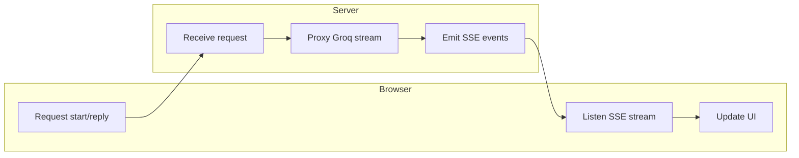

# SSE Streaming Architecture

## Purpose
Document the end-to-end streaming architecture for server-sent events in the interview simulator.

## Why SSE?

- Works well for text-only incremental updates
- Simple browser consumption model
- Compatible with Bun streaming responses
- No additional WebSocket server needed for MVP

## Stream anatomy

- **Event type**: `data`
- **Payload**: JSON object with `type` and `content`
- **Termination**: explicit `done` event

## Server behavior

- Start response with SSE headers
- Emit an initial `system` event with prompt text
- Emit `delta` events as Groq returns token content
- End with `done`

## Browser behavior

- Create an event stream reader
- Append `delta` content to the active assistant message
- Handle `done` event to enable user input again
- Handle `error` or disconnect gracefully

## SSE lifecycle diagram



## Message format

```json
{"type":"delta","content":"This is the next part of the answer."}
```

## Example browser consumption

```js
const response = await fetch('/api/start', { method: 'POST', body: JSON.stringify(payload) });
const reader = response.body.getReader();
while (true) {
  const { value, done } = await reader.read();
  if (done) break;
  const chunk = decoder.decode(value, { stream: true });
  processSseChunk(chunk);
}
```

## Error handling notes

- If Bun encounters a stream error, close with `done`
- Consider emitting `error` message objects inside SSE
- Avoid sending raw stack traces to browser

## Scalability notes

- Short-lived SSE connections are easier to maintain
- Use Bun’s efficient streaming pipeline
- Track open connections if moving beyond MVP

## Optimization ideas

- Use `event: delta` with smaller payloads
- Deduplicate repeated text events if necessary
- Keep the SSE parser lightweight in frontend
