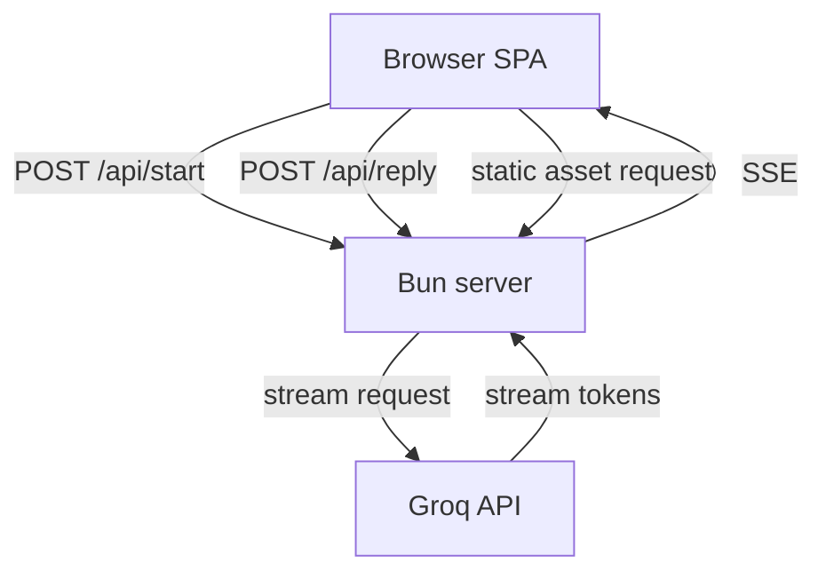

# System Architecture

## Overview
This document captures the high-level architecture of the AI Interview Simulator, focusing on Bun as the runtime, Groq as the AI backend, and a stateless client-server model.

## System components

- **Browser SPA** (`public/index.html`)
  - UI for job description, chat, speech, and scorecard
  - Sends API calls to Bun

- **Bun backend** (`src/server.ts`)
  - Receives API requests
  - Builds prompts and proxies Groq streaming responses
  - Serves static frontend files

- **Groq API**
  - Provides `groq/compound-mini`
  - Streams response deltas back to Bun

## Architecture diagram

## Data flow

1. User enters job data in browser
2. Browser requests `/api/start`
3. Bun creates `systemPrompt` and streams Groq output
4. Browser displays streamed AI content
5. User answers and calls `/api/reply`
6. Bun streams the next Groq response

## Stateless server principles

- No DB required for MVP
- Client carries conversational state
- Every request is complete and independent
- Easier to scale and debug

## Deployment considerations

- Deploy Bun as a simple web service
- Configure environment variables for `GROQ_API_KEY`
- Use HTTPS termination on the edge
- Ensure SSE headers are preserved through reverse proxies

## Architecture benefits

- Simple and observable
- Minimal backend complexity
- Good fit for hackathon speed
- Facilitates AI-assisted development through clear contract boundaries
