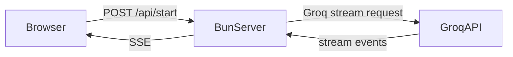

# Backend Plan

## Objective
Design the Bun backend to act as a lightweight proxy between the browser and Groq API, handling prompt assembly, streaming, and stateless request validation.

## Responsibilities

- Receive `/api/start` and `/api/reply` requests
- Build or validate `systemPrompt`
- Forward requests to Groq using `groq-sdk`
- Convert Groq streaming output into SSE
- Return structured errors

## API surface

- `POST /api/start`
  - Request body: `{ jobDescription, persona }`
  - Response: SSE stream of AI content + initial `systemPrompt`

- `POST /api/reply`
  - Request body: `{ systemPrompt, history, userMessage }`
  - Response: SSE stream of AI content

## Backend state rules

- No persistent session storage
- Server only uses request payload
- `systemPrompt` is a reproducible, deterministic prompt string

## Server architecture



## Request/response example

```json
POST /api/start
{
  "jobDescription": "Product manager with customer research experience",
  "persona": "friendly"
}
```

```http
HTTP/1.1 200 OK
Content-Type: text/event-stream

data: {"type":"system","content":"You are..."}

data: {"type":"delta","content":"Let's start with..."}
```

## Error handling

- Validate `jobDescription` and `userMessage`
- Return `400` for invalid payload
- Stream `error` events when Groq fails
- If Groq returns authentication errors, pass a human-readable message

## Hackathon MVP priorities

1. Stable request proxy
2. SSE delta forwarding
3. Simple prompt lifecycle
4. Clear error states

## Future backend improvements

- Add request rate limiting
- Add request logging and observability
- Introduce a lightweight cache for repeated prompts
- Optional webhook-style analytics
