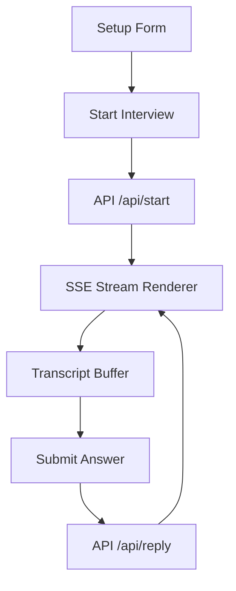

# Frontend Plan

## Objective
Define the browser-side roadmap for the interview simulator SPA, focusing on fast loading, low dependency count, and clear state flow.

## Key screens

- **Landing / setup screen**
  - Job description textarea
  - Persona selector
  - Start interview button

- **Interview screen**
  - Live AI question area
  - Transcript history
  - Text input and mic controls
  - Submit button

- **Scorecard screen**
  - Render parsed scores
  - Show final feedback
  - Offer restart and export options

## State model

- `systemPrompt: string`
- `history: Array<{role: string; content: string}>`
- `currentMessage: string`
- `isStreaming: boolean`
- `micActive: boolean`
- `scorecard: Scorecard | null`

## Frontend architecture

## Interaction design

- Show a live typing indicator while streaming
- Disable answer input during AI response
- Keep history scroll anchored to latest message
- Allow switching between text and speech modes

## Workflows

- `handleStart()`
  - Validate input
  - POST `/api/start`
  - Store `systemPrompt`
  - Start SSE listener

- `handleReply()`
  - Append user message to history
  - POST `/api/reply`
  - Process SSE updates

## Performance considerations

- Render one token delta at a time
- Batch DOM writes using `requestAnimationFrame`
- Use event delegation for chat actions
- Keep CSS minimal and responsive

## AI-assisted development notes

- Keep functions small and descriptive for Copilot discoverability
- Annotate data shapes with comments for Cursor AI
- Store the prompt builder logic in a separate helper file if added later

## MVP scope

- Single page, no routing
- Text input + voice capture
- Streaming AI reply
- Scorecard parsing and display
