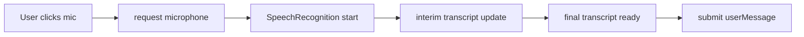

# Speech Input Plan

## Objective
Document how microphone audio is captured, converted to text, and integrated into the interview flow.

## Browser flow

1. User clicks mic button
2. Browser requests microphone permission
3. Web Speech API starts recognition
4. Interim transcript is shown live
5. On voice end, final transcript populates answer input
6. User submits text payload to `/api/reply`

## Speech recognition lifecycle

## Key states

- `micPermissionRequested`
- `micActive`
- `speechTranscript`
- `speechError`

## UX considerations

- Display a clear mic recording indicator
- Show live interim text while speaking
- Provide a manual cancel button
- Auto-populate final transcript into answer area

## Implementation notes

- Use `window.SpeechRecognition` or `webkitSpeechRecognition`
- Fallback to text input if speech is unavailable
- Keep audio processing client-side only
- Do not send audio to the server

## Error handling

- If microphone access denied, show a retry prompt
- If recognition stops unexpectedly, show a toast and allow manual typing
- Don’t block interview flow on speech failures

## Future enhancements

- Add `voice input` / `text input` toggle
- Add speech confidence visualization
- Save transcript history for export
- Add audio playback for user’s own answer review
