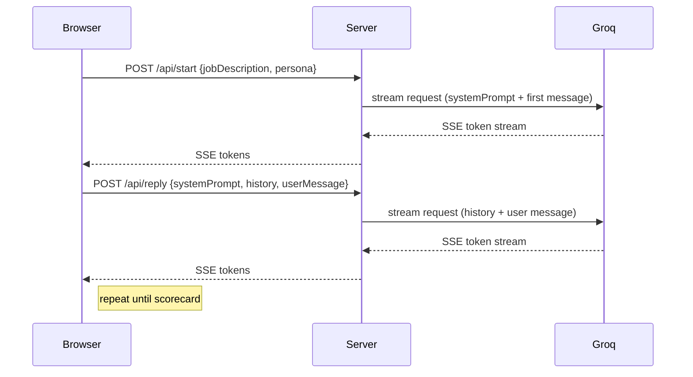

# Interview Flow

## Overview
The interview flow is a simple conversational loop that begins with an AI-generated opener, then alternates between candidate answers and AI questions until a closing scorecard appears.

## Flow stages

1. **Initialization**
   - Client sends `/api/start` with `jobDescription` and `persona`.
   - Server builds `systemPrompt` and sends an SSE stream back.

2. **Question delivery**
   - AI sends the first interview prompt as a stream.
   - The frontend collects token deltas into a live message.

3. **Candidate response**
   - User submits text or speech-converted text.
   - Client appends message to history and posts `/api/reply`.

4. **AI reply and continuation**
   - Server forwards the full history and returns next streamed message.
   - Repeat until finish criteria.

5. **Scorecard and close**
   - AI returns a `<scorecard>` block after 6–8 exchanges.
   - Frontend parses scorecard and displays final results.

## Sequence diagram



## Data contract

```json
POST /api/start
{
  "jobDescription": "Senior frontend engineer",
  "persona": "technical"
}
```

```json
POST /api/reply
{
  "systemPrompt": "<system prompt text>",
  "history": [
    {"role":"user","content":"Begin the interview."},
    {"role":""assistant","content":"First question..."}
  ],
  "userMessage": "My answer..."
}
```

## Client state notes

- `systemPrompt` must be preserved across rounds
- `history` should include both user and assistant turns
- `userMessage` is the current candidate answer
- The server remains stateless; state is client-owned
