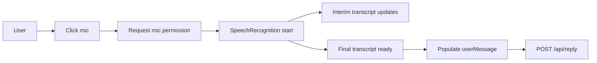

# Speech Input Specification

## Purpose
Define the speech capture, interim transcription, and client-side integration behavior for the interview simulator.

## Objectives
- Capture microphone audio using the Web Speech API
- Provide live interim transcript to the user while speaking
- Convert final transcript to `userMessage` for `/api/reply`
- Fall back to text-only input if speech is unavailable

## Browser flow

1. User taps the mic button.
2. The app requests microphone permission.
3. `SpeechRecognition` starts and emits `interim` and `final` transcripts.
4. Interim text is displayed live; the final text is placed in the answer input.
5. User can edit the final transcript before submitting.

## Key states and events
- `micPermissionRequested` — awaiting user permission
- `micActive` — recording in progress
- `interimTranscript` — live partial text
- `finalTranscript` — finalized text
- `speechError` — permission denied or runtime error

## Implementation notes
- Use `window.SpeechRecognition` or `webkitSpeechRecognition`.
- Show a clear visual recording indicator and cancelling affordance.
- Do not send raw audio to the server — only send text transcripts.
- Allow manual edit of the final transcript before submission.
- Debounce interim updates to avoid overwhelming DOM updates.

## UX considerations
- Show confidence percentages when available (optional).
- Allow a quick retry if recognition fails.
- Keep the mic button accessible and large on mobile.

## Edge cases
- If user denies permission, show an inline help message with the fallback to text input.
- If recognition yields poor results, allow the user to re-record or type.

## Testing checklist
- [ ] Permission flows (allow/deny)
- [ ] Interim transcript displayed live
- [ ] Final transcript editable before submit
- [ ] Fallback to text input
- [ ] Cross-browser checks (Chrome, Edge, Safari webkit)
